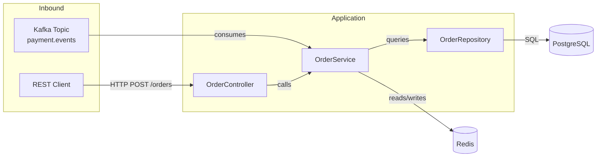

# Java Technical Documentation — GitHub Copilot Agent Skill

A GitHub Copilot Agent that reads any Java project and produces
**complete, developer-quality technical documentation** with embedded
Mermaid diagrams — all in one command.

---

## What it generates

| Section | Content |
|---|---|
| Overview | Project purpose, team, status |
| Technology Stack | Framework, DB, auth, messaging, testing |
| Project Structure | Annotated directory tree |
| Architecture Diagram | Mermaid `graph LR` — components & flows |
| Request Lifecycle | Mermaid `sequenceDiagram` — end-to-end HTTP flow |
| API Reference | Table of all REST endpoints per controller |
| Data Model | Mermaid `erDiagram` — JPA entities & relationships |
| Class Diagram | Mermaid `classDiagram` — key components |
| Configuration | Environment variables & property keys |
| Running Locally | Step-by-step shell commands |
| Testing | Test commands & coverage summary |
| Design Decisions | Patterns used and why |
| TODOs / Limitations | Collected from `// TODO` & `// FIXME` comments |

All diagrams render natively on GitHub.

---

## Installation

### Option A — Copy into your repo (recommended)

```bash
# From your project root
mkdir -p .github/skills
cp -r java-doc-agent-skill/ .github/skills/java-doc-agent/
cp java-doc-agent-skill/copilot-agent.yml .github/copilot-agent.yml
```

### Option B — Use as a standalone Copilot Agent

1. Copy `copilot-agent.yml` to `.github/copilot-agent.yml` in your repo.
2. GitHub Copilot will auto-discover the agent.

---

## Usage

Once installed, invoke the agent in any Copilot Chat panel:

```
@java-doc-agent document this project
```

Other supported prompts:

```
@java-doc-agent generate technical documentation
@java-doc-agent create architecture diagrams
@java-doc-agent explain the codebase
@java-doc-agent generate an API reference for all controllers
@java-doc-agent explain the data model and entity relationships
@java-doc-agent update the documentation after my last commit
```

The agent writes output to:
```
docs/TECHNICAL_DOCUMENTATION.md
```

---

## Skill file structure

```
java-doc-agent-skill/
├── SKILL.md                          # Main agent instructions
├── copilot-agent.yml                 # GitHub Copilot agent definition
├── templates/
│   └── doc-template.md              # Documentation template with all sections
├── references/
│   └── diagram-rules.md             # Mermaid diagram rules & examples
└── scripts/
    └── java_project_scanner.py      # Optional: standalone Python project scanner
```

### Using the standalone scanner

If you want to pre-scan a project and pass the JSON to an LLM prompt:

```bash
python .github/skills/java-doc-agent/scripts/java_project_scanner.py /path/to/project
```

This outputs a JSON summary of all classes, endpoints, entities, TODOs, and
config keys — useful for feeding into custom pipelines.

---

## Supported Java frameworks

| Framework | Detection |
|---|---|
| Spring Boot | `@SpringBootApplication`, `spring-boot` in POM |
| Spring MVC (standalone) | `@RestController`, `@Controller` |
| Quarkus | `@QuarkusMain`, `quarkus-bom` in POM |
| Micronaut | `@MicronautApplication`, `micronaut-bom` |
| Plain Java | `public static void main` |
| Jakarta EE | `@ApplicationPath`, `@Stateless`, `@Stateful` |

---

## Customisation

Edit `SKILL.md` to adjust:
- Which sections to include / exclude
- Diagram depth (how many nodes before splitting)
- Whether to include test class inventory
- Output path (default: `docs/TECHNICAL_DOCUMENTATION.md`)

---

## Example output (excerpt)

```markdown
# order-service — Technical Documentation

## 4. Architecture

### 4a. High-Level Architecture


```

---

## Requirements

- GitHub Copilot (Individual, Business, or Enterprise)
- Java project with Maven (`pom.xml`) or Gradle (`build.gradle`)
- No additional dependencies — the agent uses Copilot's built-in file tools

---

## License

MIT — free to use, modify, and redistribute.
