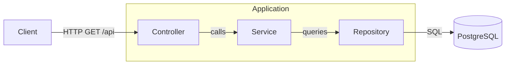
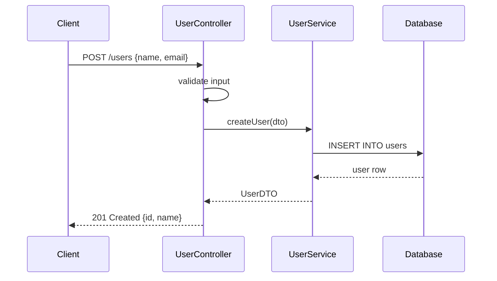
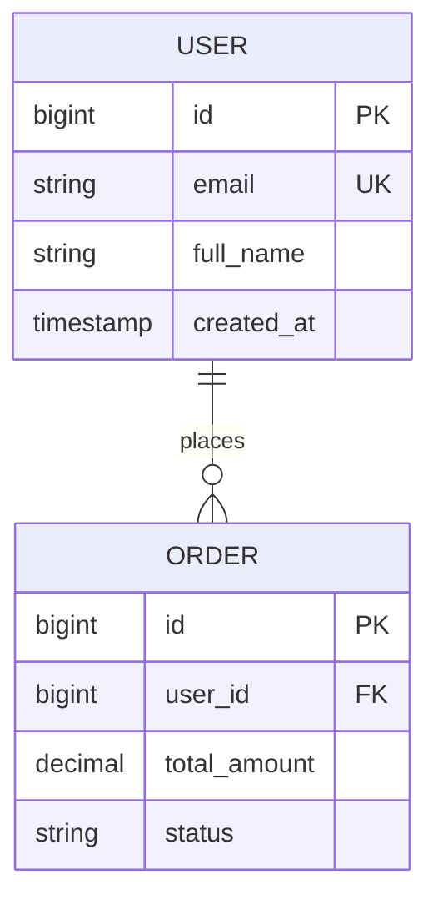
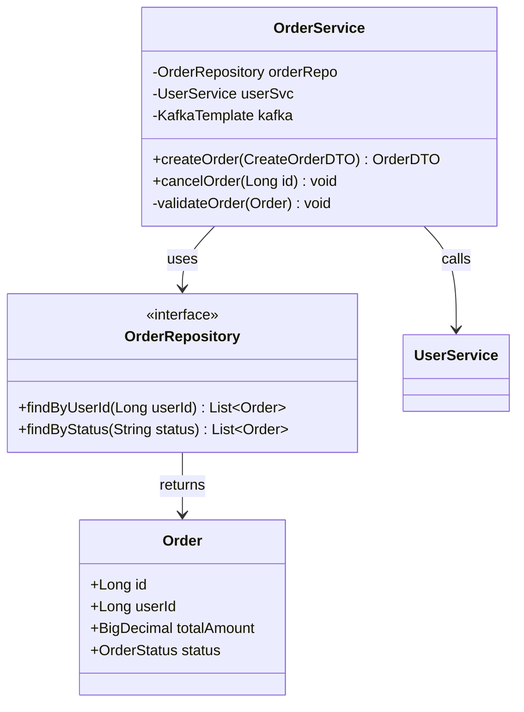
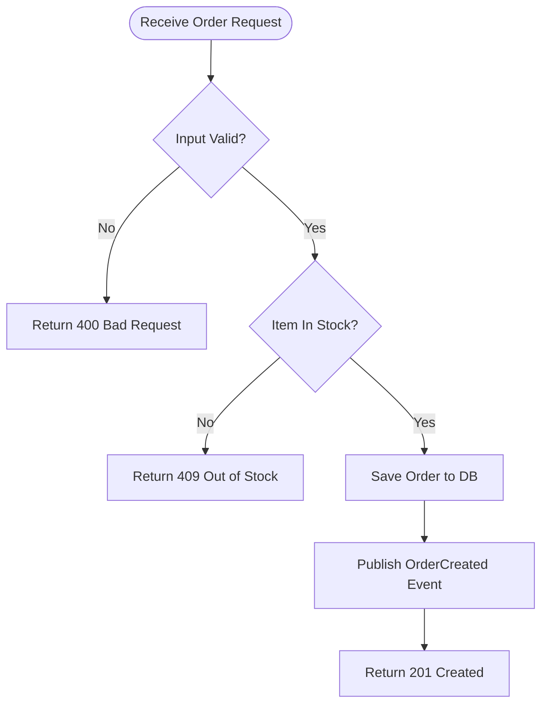
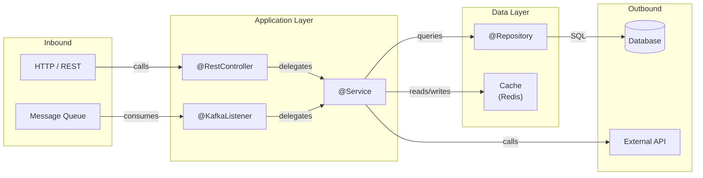

# Diagram Rules — Java Doc Agent

All diagrams MUST use Mermaid syntax (renders natively in GitHub).
Never use PlantUML, graphviz, ASCII art, or image links.

---

## General Rules

1. Wrap every diagram in a fenced code block with `mermaid` as the language tag.
2. Label **every arrow** with a short active verb:
   `calls`, `returns`, `reads`, `writes`, `publishes`, `consumes`,
   `authenticates`, `delegates`, `emits`, `queries`, `resolves`.
3. Use double quotes for node labels that contain spaces or special chars.
4. Keep node IDs short (`Ctrl`, `Svc`, `Repo`) — labels can be longer.
5. If a diagram has >12 nodes, split into a high-level + a detail diagram.
6. Test syntax mentally: nested quotes must be escaped (`\"`) inside labels.

---

## Diagram Type Selection

### `graph LR` — High-Level Architecture
Use for showing **components and their relationships** at a system level.
- Boxes = components (services, databases, queues, clients)
- Arrows = data/call flows
- Group related nodes with `subgraph`

### `sequenceDiagram` — Request / Event Flow
Use when showing **time-ordered interactions** between participants.
- Use `activate` / `deactivate` for long-running operations.
- Use `alt` / `else` / `opt` for conditional branches.
- Use `loop` for retries.

### `erDiagram` — Entity Relationship
Use for **JPA entities and their database relationships**.
- List primary key (PK) and foreign key (FK) fields.
- Use relationship notation: `||--o{` (one-to-many), `}|--|{` (many-to-many).
- Include type, name, and constraint (`PK`, `FK`, `UK`).

### `classDiagram` — Class Structure
Use when showing **Java class hierarchies, interfaces, and dependencies**.
- Show visibility: `+` public, `-` private, `#` protected.
- Use stereotypes: `<<interface>>`, `<<abstract>>`, `<<enum>>`.
- Show only classes relevant to the component being documented.

### `flowchart LR` / `TD` — Business Logic / Data Flow
Use for **step-by-step logic**, pipelines, or event-driven flows.
- `TD` (top-down) for sequential steps.
- `LR` (left-right) for pipelines.
- Use `{...}` for decision diamonds, `[...]` for process boxes,
  `((...))` for start/end circles, `[/text/]` for I/O.

---

## Spring Boot Specific Patterns

### Typical Layered Architecture

---

## Common Mistakes to Avoid

| ❌ Wrong | ✅ Correct |
|---|---|
| Unlabelled arrows | Label every arrow |
| >15 nodes in one diagram | Split into high-level + detail |
| PlantUML `@startuml` syntax | Mermaid only |
| Inline arrow text without quotes when it has spaces | Use `\|"text"\|` notation |
| Using `graph` for time-ordered flows | Use `sequenceDiagram` |
| Showing private util methods in class diagram | Show only public API |
