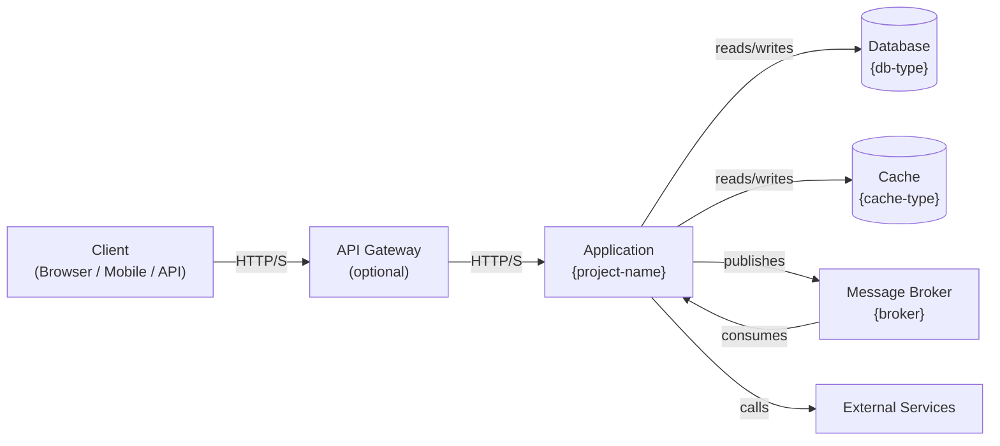
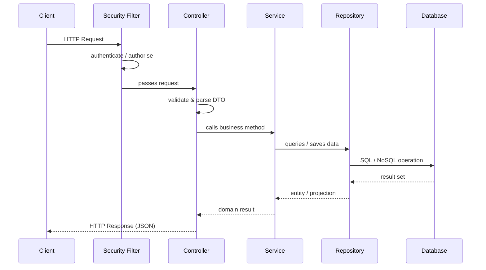
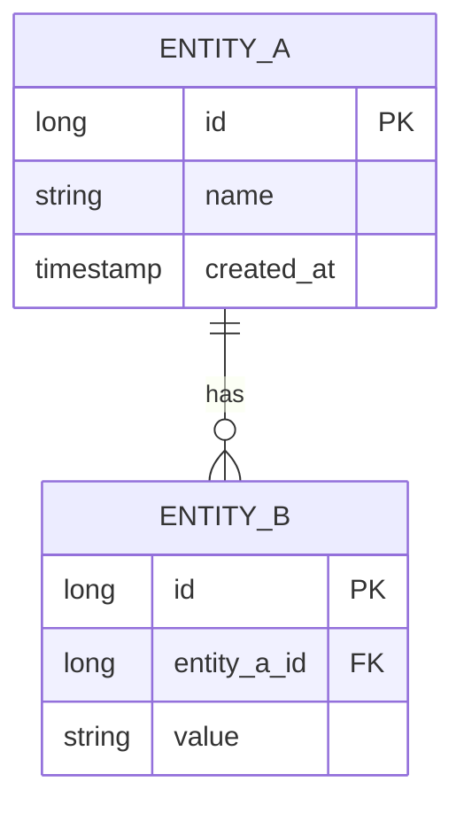

# {PROJECT_NAME} — Technical Documentation

> Auto-generated by the Java Doc Agent skill.  Last updated: {DATE}

---

## 1. Overview

{One paragraph: what the project does, who uses it, what problem it solves.}

**Repository:** `{repo-url or local path}`
**Team / Owner:** {team name if discoverable}
**Status:** {Active / Beta / Deprecated — infer from README or pom version}

---

## 2. Technology Stack

| Layer | Technology | Version |
|---|---|---|
| Language | Java | {java.version} |
| Framework | {Spring Boot / Quarkus / …} | {version} |
| Build Tool | {Maven / Gradle} | {version} |
| Database | {PostgreSQL / MySQL / MongoDB / H2 / …} | — |
| ORM / Data | {Spring Data JPA / MyBatis / …} | — |
| Auth | {Spring Security / Keycloak / JWT / …} | — |
| Messaging | {Kafka / RabbitMQ / SQS / none} | — |
| Caching | {Redis / Caffeine / none} | — |
| Testing | {JUnit 5 / Mockito / Testcontainers} | — |
| Containerisation | {Docker / Podman / none} | — |

---

## 3. Project Structure

```
{project-root}/
├── src/
│   ├── main/
│   │   ├── java/
│   │   │   └── {base.package}/
│   │   │       ├── {MainClass}.java          # Application entry point
│   │   │       ├── controller/               # REST controllers
│   │   │       ├── service/                  # Business logic
│   │   │       ├── repository/               # Data access
│   │   │       ├── model/ (or entity/)       # Domain/JPA entities
│   │   │       ├── dto/                      # Request/Response DTOs
│   │   │       ├── config/                   # Spring configuration beans
│   │   │       ├── exception/                # Custom exceptions & handlers
│   │   │       └── util/                     # Utilities & helpers
│   │   └── resources/
│   │       ├── application.yml               # Main config
│   │       ├── application-dev.yml           # Dev profile overrides
│   │       └── db/migration/                 # Flyway/Liquibase scripts
│   └── test/
│       └── java/{base.package}/
│           ├── unit/                         # Unit tests
│           └── integration/                  # Integration tests
├── Dockerfile
├── docker-compose.yml
└── pom.xml / build.gradle
```

---

## 4. Architecture

### 4a. High-Level Architecture



> Remove nodes that do not apply to this project.

### 4b. Request Lifecycle



---

## 5. API Reference

> One sub-section per controller.  List every endpoint.

### {ControllerName}

Base path: `{/api/v1/resource}`

| Method | Path | Auth | Request Body | Response | Description |
|---|---|---|---|---|---|
| GET | `/{id}` | Bearer JWT | — | `{ResourceDTO}` | Fetch by ID |
| POST | `/` | Bearer JWT | `{CreateRequest}` | `{ResourceDTO}` | Create resource |
| PUT | `/{id}` | Bearer JWT | `{UpdateRequest}` | `{ResourceDTO}` | Update resource |
| DELETE | `/{id}` | Bearer JWT | — | `204 No Content` | Delete resource |

#### Error Responses

| HTTP Code | Reason |
|---|---|
| 400 | Validation failure |
| 401 | Missing / invalid token |
| 403 | Insufficient permissions |
| 404 | Resource not found |
| 500 | Internal server error |

---

## 6. Data Model

### Entity Relationship Diagram



---

## 7. Class Diagram (Key Components)

```mermaid
classDiagram
    class {ServiceName} {
        -{RepositoryName} repository
        +{ReturnType} {methodName}({ParamType} param)
    }
    class {RepositoryName} {
        <<interface>>
        +findBy{Field}({Type} value) List~Entity~
    }
    class {EntityName} {
        +Long id
        +String {field}
    }
    {ServiceName} --> {RepositoryName} : uses
    {RepositoryName} --> {EntityName} : returns
```

---

## 8. Configuration & Environment Variables

| Variable / Property | Default | Required | Description |
|---|---|---|---|
| `SPRING_DATASOURCE_URL` | — | ✅ | JDBC connection string |
| `SPRING_DATASOURCE_USERNAME` | — | ✅ | DB username |
| `SPRING_DATASOURCE_PASSWORD` | — | ✅ | DB password |
| `SERVER_PORT` | `8080` | ❌ | HTTP port |
| `JWT_SECRET` | — | ✅ | Token signing key |
| `SPRING_PROFILES_ACTIVE` | `dev` | ❌ | Active Spring profile |

> Add all properties discovered from `application.yml` / `application.properties`.

---

## 9. Running Locally

### Prerequisites
- Java {version}+
- Maven {version}+ **or** Gradle {version}+
- Docker & Docker Compose (for dependencies)
- {Any other tool}

### Steps

```bash
# 1. Clone the repo
git clone {repo-url}
cd {project-folder}

# 2. Start dependencies (DB, cache, broker)
docker-compose up -d

# 3. Configure environment
cp .env.example .env
# Edit .env with your values

# 4. Build and run
./mvnw spring-boot:run -Dspring-boot.run.profiles=dev
# or
./gradlew bootRun --args='--spring.profiles.active=dev'
```

Application starts at: `http://localhost:{port}`

---

## 10. Testing

```bash
# Run all tests
./mvnw test

# Run with coverage report
./mvnw verify

# Run a specific test class
./mvnw -Dtest={TestClassName} test

# Integration tests only (if using Failsafe)
./mvnw verify -P integration-tests
```

### Test Coverage Summary

| Layer | Framework | Notes |
|---|---|---|
| Unit | JUnit 5 + Mockito | Services, utilities |
| Integration | Testcontainers | Repositories with real DB |
| Contract | {Pact / Spring Cloud Contract / —} | API contracts |

---

## 11. Key Design Decisions & Patterns

- **{Pattern name}**: {Why it was chosen and where it is applied.}
- **{Pattern name}**: {Why it was chosen and where it is applied.}

Examples to fill in:
- Layered (Controller → Service → Repository) vs Clean Architecture
- DTO / Mapper pattern (MapStruct, manual, etc.)
- Transaction boundaries
- Caching strategy
- Error handling approach (`@ControllerAdvice`)
- Authentication mechanism

---

## 12. Known Limitations & TODOs

> Collected from `// TODO`, `// FIXME`, and `// HACK` comments in source.

| File | Line | Note |
|---|---|---|
| {ClassName.java} | {line} | {comment text} |

### Build / Runtime Issues
{List any errors from `get_errors` if available, otherwise omit section.}
